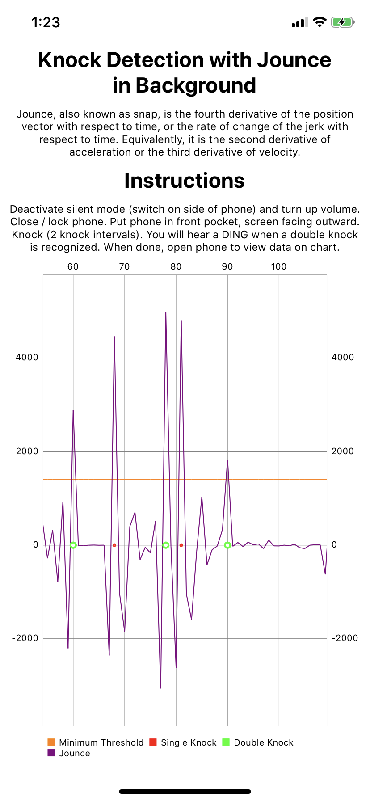

# knock-knock
An iOS app where knocking twice on your phone screen (like a door) produces a feedback notification and sound

## How to use
* Open app
* Agree to push notifications permissions
* Agree to localization permissions
* Manually agree to localization permissions as alwaysActive in the Settings app of the iPhone
* Turn the sound on your phone
* Deactivate silent mode (the switch on the side of your phone)
* Close your phone screen
* Stand up
* Put your phone in your front pants pocket with the screen facing out, away from the leg.
* Knock twice on your phone screen like knocking on a door. If this double knock is detected, you will hear a "DING" sound and see a notification on your phone.

## How it works
* The app listens to the acceleration of your device while the phone screen is locked.
* The app calculates Jounce (or snap) based on the acceleration, and charts it on the graph.
* If the jounce passes the minimum threshold, it is registered as a single knock.
* If two single knocks are registered within a specific time frame, a double knock is registered.
* To keep the knock detection working in the background, we couple the CMMotionManager full-time location updates in the background. (CLLocationManager, allow background location updates, etc.)

## How to Contribute
* Want to contribute? Make a pull request or send me a direct message on Twitter @RobinKanatzar